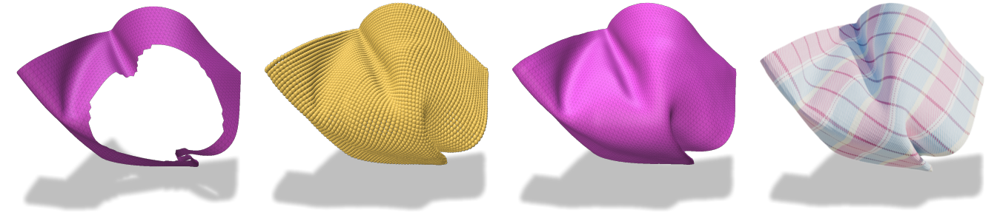

# Neural Inpainting of Folded Fabrics with Interactive Editing

This repository contains a research prototype implementation of "Neural Inpainting of Folded Fabrics with Interactive Editing", Computer & Graphics.

The proposed method aims at filling holes in incomplete meshes representing fabrics. The provided files enable the user to either retrain the network or to directly apply it to data using the provided weights. Additionally, the user can use several editing tools to guide the output predicted by the network. The repository also contains the ScarfFolds dataset used for the training.


## Requirements

Download the repo and open it using:
```bash
git clone https://github.com/g-gisbert/Neural-Inpainting-Of-Folded-Fabric-Meshes.git
cd Neural-Inpainting-Of-Folded-Fabric-Meshes
```

You can easily create a conda environment with all the necessary dependencies:
```bash
conda env create -f environment.yaml
conda activate NIF
```

To download the weights and the database, use the command:
```bash
./downloadWeights.sh
```
This will also extract the dataset archive.

We recommend using the 'standard.tar' weights for most cases. 'gravity.tar' has been trained without rotations so the prediction takes the orientation into account.
'interpen.tar' has been trained with a larger weight on the auto-intersection loss term and should predict fewer auto-intersected surfaces.

## Training

The `train.py` file contains a `conf` dictionnary representing all the available settings. The first 3 are self-explanatory.

* `lr_factor`, `lr_patience`, `lr_min` and `lr_threshold` are parameters for the optimizer scheduler
* `alpha` : weight of the data term in the loss
* `beta` : weight of the auto-intersection term in the loss
* `gamma` : weight of the gradient term in the loss

To train the network, simply type:
```bash
python trainUnet.py
```

The output folder will contains the latest weights file and the weights that minimize the loss. The `experiments` folder contains forward passes 

## Inference

To use the model on the data provided, use the followning command:
```bash
python inferencePolyscope.py [path/to/weights] [path/to/file] [grab | twist | pinch]
```
Grab, twist and pinch represent the different editing tools available. Choose the one to use. 


To test the proposed example:
```bash
python inferencePolyscope.py ./weights/standard.tar ./examples/sim1_hole.ply grab
```

## Preprocessing

The `example` folder contains parametrized meshes, which is the input required but the network. To process other obj files and parametrize them, you can use the C++ program located in the `HoleMeshTo2D` folder.
```bash
cd HoleMeshTo2D
mkdir build
cd build
cmake ..
make -j8
```

The program is used as follows :
```bash
./bin/pgm [path/to/obj] [nTriangleStrips]
```
The `nTriangleStrips` defines the size of the region arround the hole you want to consider for the inpainting task. 

You can test the example obj mesh (which will produce the same `ply` file as the one in the `example` folder) by typing :
```bash
./bin/pgm ../../objs/sim1_hole.obj 16
```

This will open a window showing the parametrization and create the `ply` file.